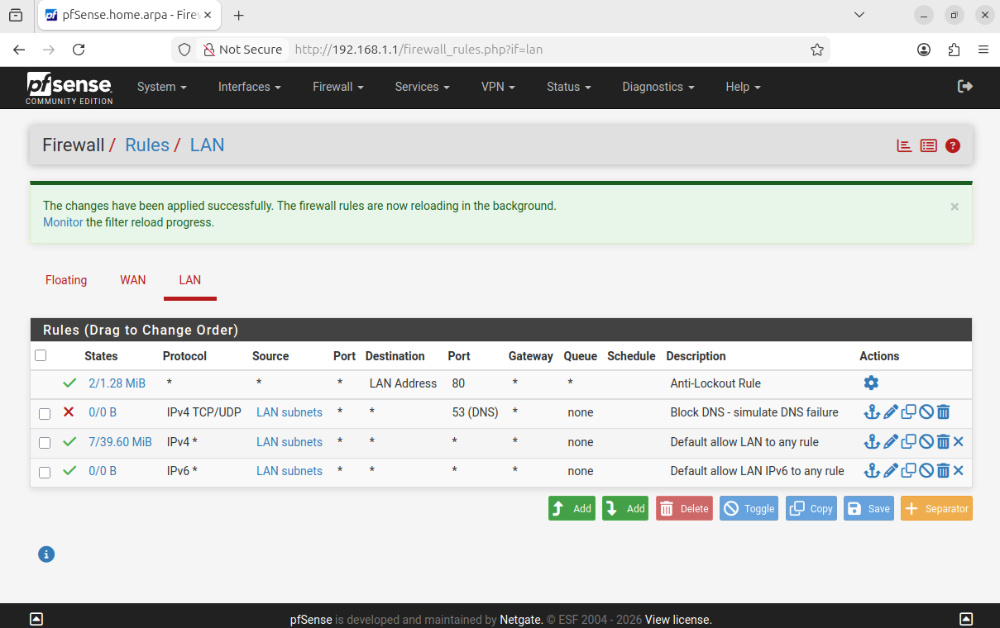
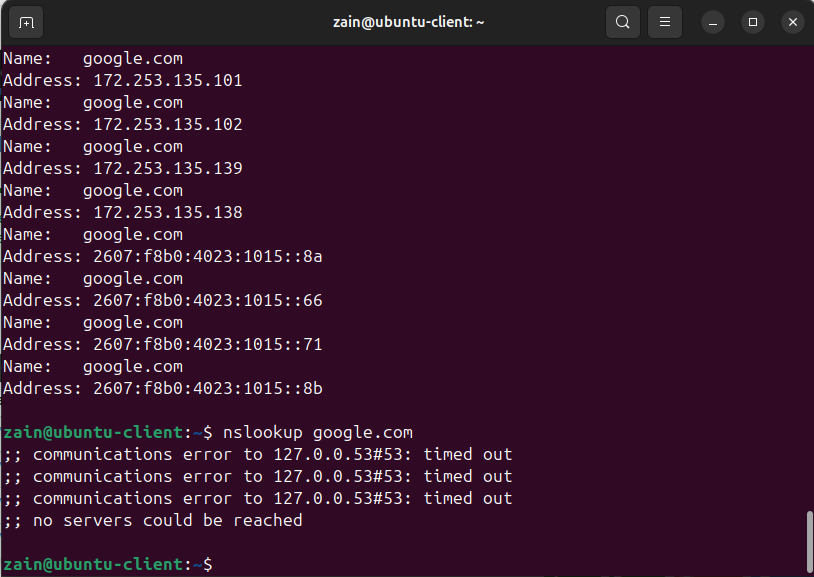
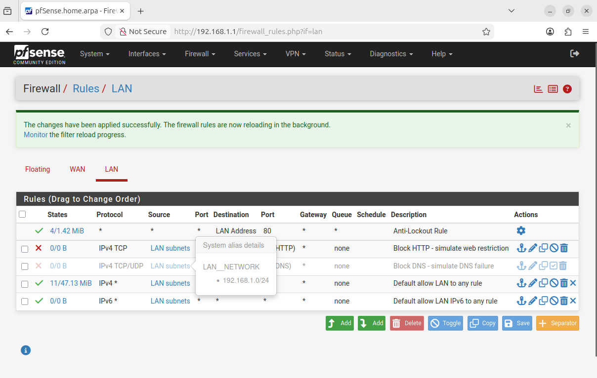
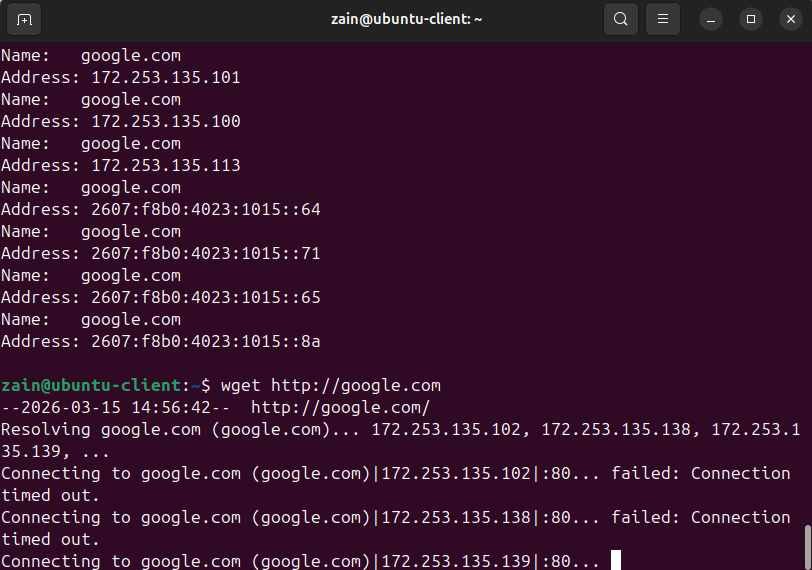
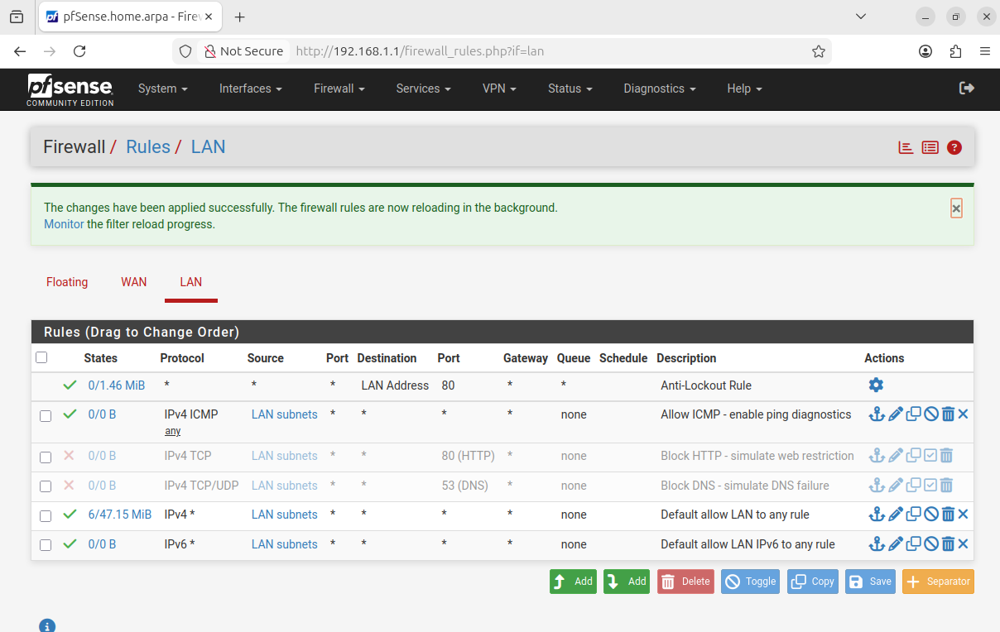
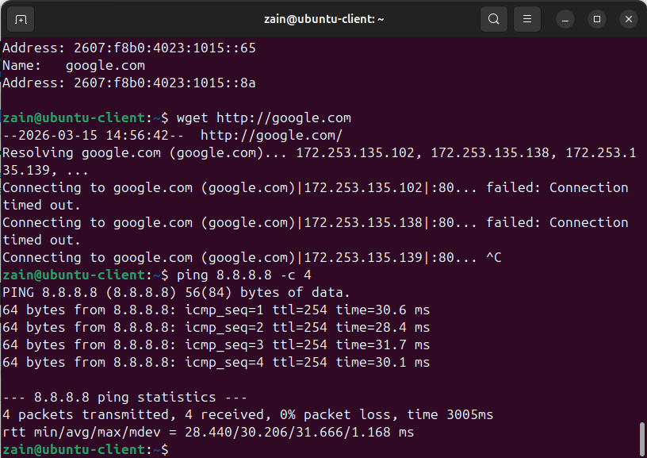
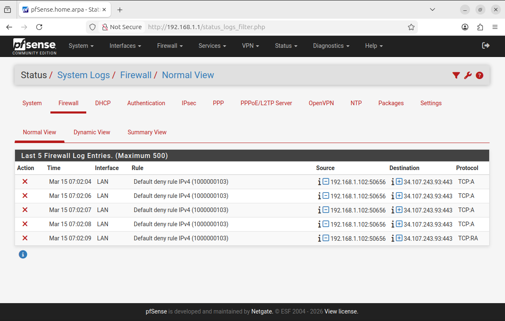

# Network Troubleshooting & Firewall Lab (pfSense + Linux)

A virtual networking lab built with pfSense and Ubuntu Linux to simulate real-world firewall configuration, NAT routing, and network troubleshooting scenarios. This project demonstrates hands-on experience with firewall rule management, DNS and HTTP traffic control, ICMP diagnostics, and packet-level log analysis.

---

## Architecture

```
Internet (NAT)
      │
      │ WAN (em0) — 10.0.2.15/24
      ▼
┌─────────────┐
│   pfSense   │  ← Firewall / Router / DHCP Server
│  Firewall   │
└─────────────┘
      │ LAN (em1) — 192.168.1.1/24
      │
      ▼
┌─────────────┐
│   Ubuntu    │  ← LAN Client (192.168.1.102)
│   Client    │
└─────────────┘
```

---

## Lab Environment

| Component | Details |
|---|---|
| Hypervisor | VirtualBox 7.x |
| Firewall/Router | pfSense CE 2.8.1 (FreeBSD) |
| LAN Client | Ubuntu 24.04 LTS |
| WAN Interface | NAT (VirtualBox) |
| LAN Interface | Internal Network (`intnet`) |
| LAN Subnet | 192.168.1.0/24 |
| pfSense LAN IP | 192.168.1.1 |
| Client IP | 192.168.1.102 (DHCP) |

---

## Prerequisites

- Windows + VirtualBox 7.x
- pfSense CE ISO (netgate-installer AMD64)
- Ubuntu 24.04 LTS ISO
- VirtualBox Extension Pack

---

## Lab Setup

### 1. pfSense VM Configuration
- **Type:** FreeBSD (64-bit)
- **Memory:** 1024 MB
- **Disk:** 10 GB
- **Adapter 1:** NAT (WAN)
- **Adapter 2:** Internal Network — `intnet` (LAN)

### 2. Ubuntu VM Configuration
- **Type:** Ubuntu (64-bit)
- **Memory:** 2048 MB
- **Disk:** 20 GB
- **Adapter 1:** Internal Network — `intnet` (LAN)

### 3. pfSense Interface Assignment
```
WAN → em0 (DHCP from VirtualBox NAT)
LAN → em1 (Static: 192.168.1.1/24)
```

### 4. pfSense LAN Configuration
- **LAN IP:** 192.168.1.1/24
- **DHCP Range:** 192.168.1.100 – 192.168.1.200
- **Web UI:** http://192.168.1.1

---

## Firewall Rules Configured

### Default Baseline
pfSense ships with two default LAN rules:
- **Anti-Lockout Rule** — always allows access to web UI on port 80
- **Default allow LAN to any** — permits all outbound IPv4 traffic

### Custom Rules Added

| Rule | Action | Protocol | Port | Purpose |
|---|---|---|---|---|
| Block DNS | Block | TCP/UDP | 53 | Simulate DNS failure |
| Block HTTP | Block | TCP | 80 | Simulate web restriction |
| Allow ICMP | Pass | ICMP | any | Enable ping diagnostics |

---

## Fault Injection & Troubleshooting Scenarios

### Scenario 1 — DNS Failure

**Rule:** Block TCP/UDP port 53 from LAN subnets

**Symptom on client:**
```bash
nslookup google.com
;; communications error to 127.0.0.53#53: timed out
;; no servers could be reached
```

**Diagnosis:**
```bash
# Verify DNS is blocked
nslookup google.com

# Check routing table
ip route

# Verify interface is up
ip addr
```

**Resolution:** Disable or remove the DNS block rule in pfSense → Firewall → Rules → LAN, then apply changes.




---

### Scenario 2 — HTTP Access Blocked

**Rule:** Block TCP port 80 from LAN subnets

**Symptom on client:**
```bash
wget http://google.com
Connecting to google.com|172.253.135.102|:80... failed: Connection timed out.
```

**Diagnosis:**
```bash
# Test HTTP connectivity
wget http://google.com

# Verify DNS still works (only port 80 blocked)
nslookup google.com

# Check if HTTPS works (different port)
wget https://google.com
```

**Key observation:** DNS resolves successfully but TCP connection on port 80 times out — confirms port-level blocking rather than a routing or DNS issue.

**Resolution:** Disable the HTTP block rule in pfSense → Firewall → Rules → LAN, then apply changes.




---

### Scenario 3 — ICMP Diagnostics

**Rule:** Explicitly allow ICMP from LAN subnets

**Verification:**
```bash
ping 8.8.8.8 -c 4
64 bytes from 8.8.8.8: icmp_seq=1 ttl=254 time=30.6 ms
64 bytes from 8.8.8.8: icmp_seq=2 ttl=254 time=28.4 ms
64 bytes from 8.8.8.8: icmp_seq=3 ttl=254 time=31.7 ms
64 bytes from 8.8.8.8: icmp_seq=4 ttl=254 time=30.1 ms
4 packets transmitted, 4 received, 0% packet loss
```

**Use case:** ICMP rules are used to control whether hosts can be pinged for diagnostics. Explicitly allowing ICMP ensures ping-based health checks work even when other traffic restrictions are in place.




---

## Firewall Log Analysis

pfSense logs all blocked traffic in real time. Logs are accessible at **Status → System Logs → Firewall**.

Each log entry shows:
- **Action** — block or pass
- **Interface** — which interface the traffic arrived on
- **Source IP/Port** — originating host
- **Destination IP/Port** — target host
- **Protocol** — TCP, UDP, ICMP etc.

Example blocked traffic from log:
```
Action: Block
Interface: LAN
Rule: Default deny rule IPv4
Source: 192.168.1.102:50656
Destination: 34.107.243.93:443
Protocol: TCP
```

This demonstrates the ability to trace specific blocked connections back to their source and destination — a core skill in network troubleshooting and firewall administration.



---

## NAT Configuration

pfSense handles NAT automatically for the WAN interface. All traffic from the LAN (192.168.1.0/24) is masqueraded behind the WAN IP (10.0.2.15) when routed to the internet.

To verify NAT is working:
```bash
# From Ubuntu client
ping 8.8.8.8 -c 4          # Direct IP — tests routing + NAT
nslookup google.com         # Tests DNS resolution
wget https://google.com     # Tests full outbound internet access
```

---

## Key Diagnostic Commands

```bash
# Check IP address and interface status
ip addr

# Check routing table
ip route

# Test connectivity to gateway
ping 192.168.1.1 -c 4

# Test DNS resolution
nslookup google.com

# Test HTTP connectivity
wget http://google.com

# Test internet connectivity
ping 8.8.8.8 -c 4
```

---

## Key Takeaways

- Configured a **virtual network** with pfSense acting as firewall, router, and DHCP server
- Set up **NAT** to route LAN client traffic through the WAN interface to the internet
- Created and validated **firewall rules** to block DNS, block HTTP, and allow ICMP
- Performed **fault injection** by deliberately blocking traffic and diagnosing failures from the client
- Used **firewall logs** to trace blocked packets by source IP, destination IP, port, and protocol
- Differentiated between **routing issues**, **DNS failures**, and **port-level blocking** through structured troubleshooting
